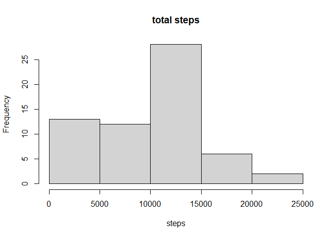
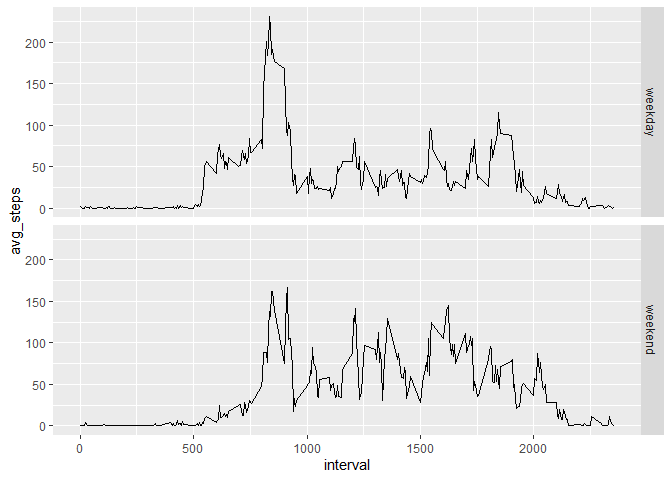

0.Set the enviroment and Read the data file
-------------------------------------------

    library(dplyr)
    library(ggplot2)

    activity<-read.csv('E:/data science/R-data-practice/repdata_data_activity/activity.csv')

1.What is mean total number of steps taken per day?
---------------------------------------------------

1.Calculate the total number of steps taken per day.

    activity<-group_by(activity,date)
    steps<-summarise(activity,steps=sum(steps,na.rm=T))
    head(steps)

    ## # A tibble: 6 x 2
    ##   date       steps
    ##   <chr>      <int>
    ## 1 2012-10-01     0
    ## 2 2012-10-02   126
    ## 3 2012-10-03 11352
    ## 4 2012-10-04 12116
    ## 5 2012-10-05 13294
    ## 6 2012-10-06 15420

2.Make a histogram of the total number of steps taken each day.

    hist(steps$steps,main = 'total steps',xlab = 'steps')

3.Calculate and report the mean and median of the total number of steps
taken per day.

    total_step<-c(mean=mean(steps$steps),median=median(steps$steps))
    total_step

    ##     mean   median 
    ##  9354.23 10395.00

2.What is the average daily activity pattern?
---------------------------------------------

1.Make a time series plot (i.e. type = “l”) of the 5-minute interval
(x-axis) and the average number of steps taken, averaged across all days
(y-axis)

    activity<-group_by(activity,interval)
    avg_step<-summarise(activity,steps=mean(steps,na.rm = T))
    avg_step<-avg_step%>%mutate(steps=as.integer(steps))# as integer
    plot(avg_step$interval,avg_step$steps,type = 'l',ylab = 'average of steps',xlab = 'interval')

2.Which 5-minute interval, on average across all the days in the
dataset, contains the maximum number of steps?

    max_interval<-avg_step[which(avg_step$steps==max(avg_step$steps)),]
    max_interval

    ## # A tibble: 1 x 2
    ##   interval steps
    ##      <int> <int>
    ## 1      835   206

3.Imputing missing values
-------------------------

1.Calculate and report the total number of missing values in the dataset
(i.e. the total number of rows with NAs)

    sum(is.na(activity))

    ## [1] 2304

2.Devise a strategy for filling in all of the missing values in the
dataset. The strategy does not need to be sophisticated. For example,
you could use the mean/median for that day, or the mean for that
5-minute interval, etc.

3.Create a new dataset that is equal to the original dataset but with
the missing data filled in.

    #Creat a new data.frame.
    activity2<-activity
    #fill the missing values with the mean for that 5-minute interval
    for(i in avg_step$interval){
    activity2[activity2$interval==i&is.na(activity2$steps),]$steps<-avg_step$steps[avg_step$interval==i]
    }
    #check
    sum(is.na(activity2))

    ## [1] 0

4.Make a histogram of the total number of steps taken each day and
Calculate and report the mean and median total number of steps taken per
day. Do these values differ from the estimates from the first part of
the assignment? What is the impact of imputing missing data on the
estimates of the total daily number of steps?

    activity2<-group_by(activity2,date)
    steps<-summarise(activity2,steps=sum(steps,na.rm=T))
    hist(steps$steps,main = 'total steps',xlab = 'steps')

    total_step2<-c(mean=mean(steps$steps),median=median(steps$steps))
    total_step2

    ##     mean   median 
    ## 10749.77 10641.00

    #the value before
    total_step

    ##     mean   median 
    ##  9354.23 10395.00

Easy to see that the mean and the median of the data are increased.

4.Are there differences in activity patterns between weekdays and weekends?
---------------------------------------------------------------------------

1.Create a new factor variable in the dataset with two levels –
“weekday” and “weekend” indicating whether a given date is a weekday or
weekend day.

    Sys.setlocale("LC_TIME", "English")

    ## [1] "English_United States.1252"

    activity2<-mutate(activity2,weekdays=weekdays(as.Date(date)))
    activity2<-mutate(activity2,weekdays=recode(weekdays(as.Date(date)),
                      'Saturday'='weekend','Sunday'='weekend',.default = 'weekday'))
    #the  weekday is in CHINESE, but the Rmarkdown could not code that, only a check.
    head(activity2)

    ## # A tibble: 6 x 4
    ## # Groups:   date [1]
    ##   steps date       interval weekdays
    ##   <int> <chr>         <int> <chr>   
    ## 1     1 2012-10-01        0 weekday 
    ## 2     0 2012-10-01        5 weekday 
    ## 3     0 2012-10-01       10 weekday 
    ## 4     0 2012-10-01       15 weekday 
    ## 5     0 2012-10-01       20 weekday 
    ## 6     2 2012-10-01       25 weekday

2.Make a panel plot containing a time series plot (i.e. type = “l”) of
the 5-minute interval (x-axis) and the average number of steps taken,
averaged across all weekday days or weekend days (y-axis). See the
README file in the GitHub repository to see an example of what this plot
should look like using simulated data.

    activity2<-group_by(activity2,weekdays,interval)
    st2<-summarise(activity2,avg_steps=mean(steps))
    g<-ggplot(st2,aes(x=interval,y=avg_steps))
    g+geom_line()+facet_grid(weekdays~.)

